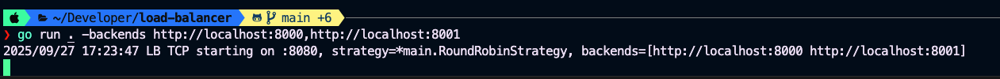

# Load Balancer

A simple reverse proxy (load balancer) built using Go.

## Features

- **TCP load balancing**: Distributes incoming TCP connections across multiple backend servers.
- **Pluggable strategies**: Supports round-robin and least-connections algorithms.
- **Health checks**: Tracks backend availability.
- **Concurrency-safe**: Uses Go's concurrency primitives for safe connection handling.



## Getting Started

### Prerequisites

- Go 1.25.1 or newer
- (Optional) `golangci-lint` for linting

### Setup

1. **Clone the repository**

   ```sh
   git clone https://github.com/kaitou-1412/load-balancer.git
   cd load-balancer
   ```

2. **Install dependencies**

   ```sh
   make deps
   ```

3. **Build the application**

   ```sh
   make build
   ```

4. **Run the application**

   ```sh
   make run
   ```

   By default, the main entrypoint should be configured to start the balancer. You may need to edit the code to specify backend addresses and strategy.

5. **Run tests**

   ```sh
   make test
   ```

6. **Run tests with coverage**
   ```sh
   make test-coverage
   open coverage.html
   ```

### Formatting & Linting

- Format code:
  ```sh
  make fmt
  ```
- Lint code (requires `golangci-lint`):
  ```sh
  make lint
  ```

### Cleaning Up

- Remove build artifacts:
  ```sh
  make clean
  ```

## Contributing

We welcome contributions! Please follow these steps:

1. **Fork the repository** and create your branch:

   ```sh
   git checkout -b feature/your-feature
   ```

2. **Write code and tests**. Ensure all tests pass:

   ```sh
   make test
   ```

3. **Format and lint your code** before submitting:

   ```sh
   make fmt
   make lint
   ```

4. **Open a pull request** describing your changes.

### Guidelines

- Keep code simple and idiomatic.
- Write clear commit messages.
- Add unit tests for new features or bug fixes.
- Document public APIs and exported functions.

## Contact

For questions or suggestions, open an issue or submit a pull request.
